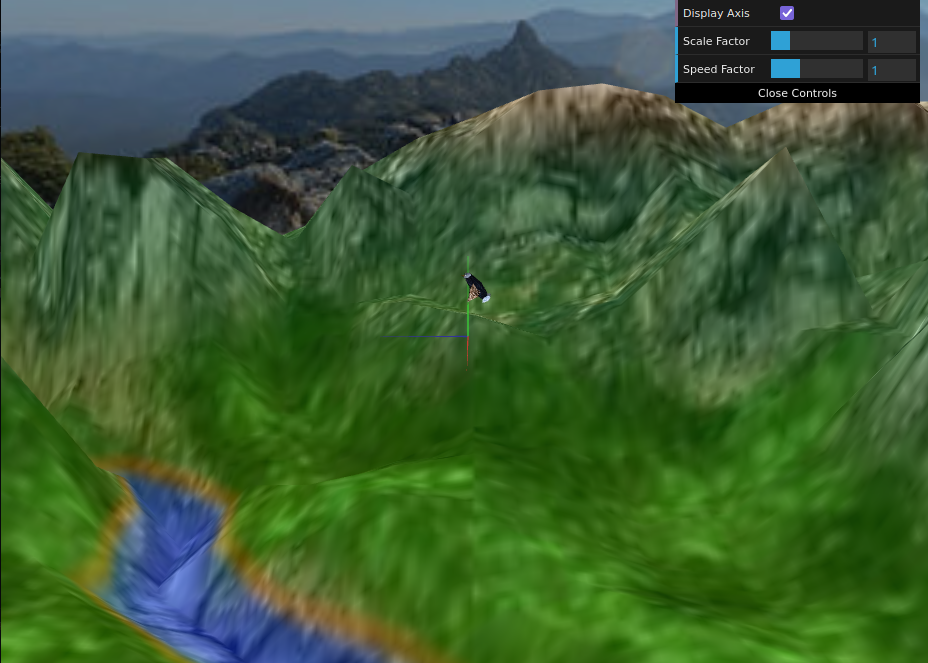
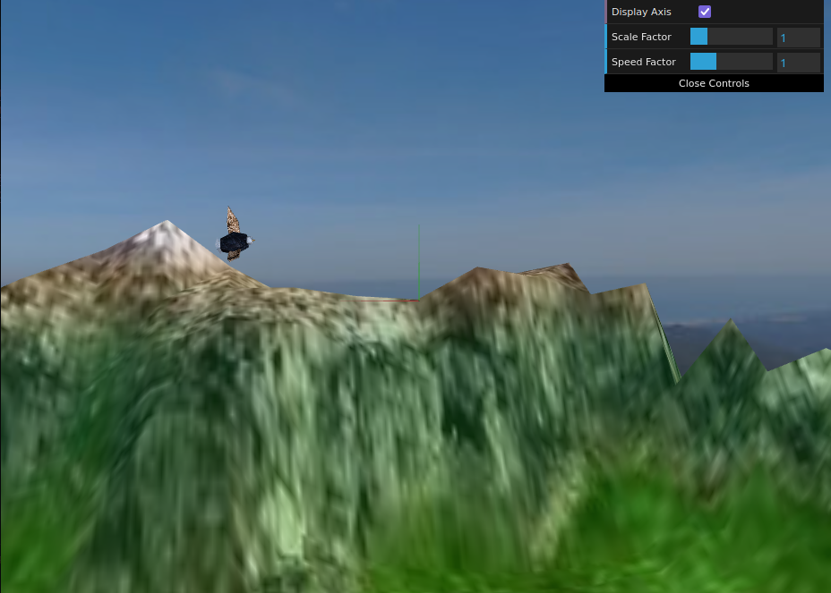

# CG 2022/2023

## Group T06G03

## Proj 

### Panorama

### Bird

### Terrain

### Eggs and Nest

### Trees

### Extras (Egg parabolic)

### Extras (Cameras - not in project specification)

  
  
  
  

