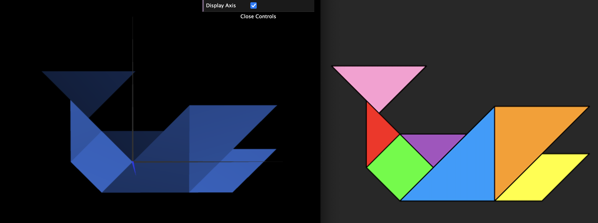
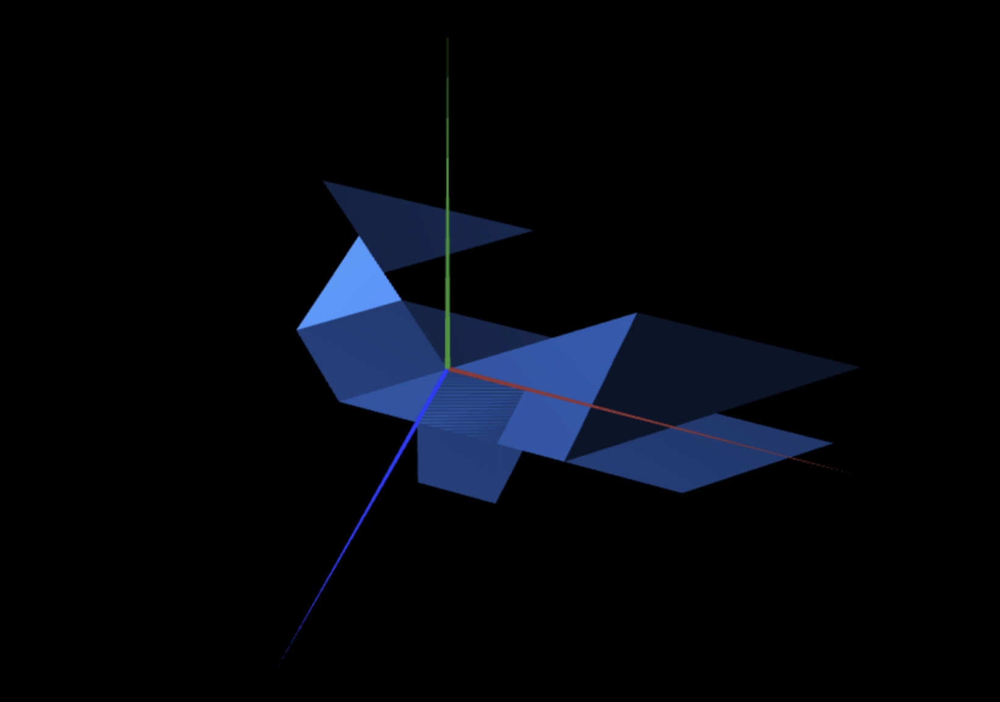
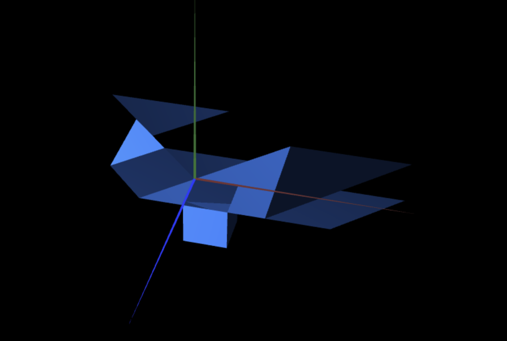

# CG 2022/2023

## Group T06G03

## TP 2 Notes

- In exercise 1 we had some difficulties in the positioning of the pieces of the tangram because of the various square roots that were necessary.

- In exercise 2 we had some difficulties in understanding what was asked in the exercise.

- In exercise 3 we did not have any difficulties.

