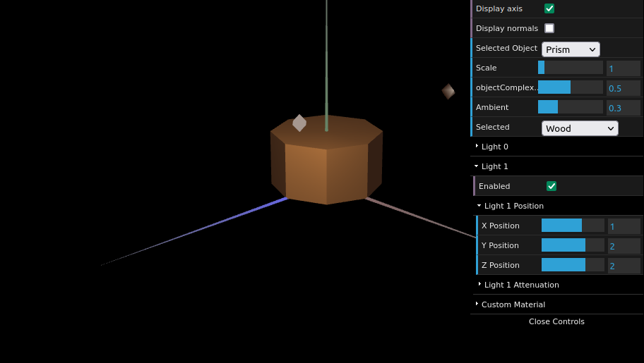

# CG 2022/2023

## Group T06G03

## TP 3 Notes

- In exercise 1 we had some difficulties in defining the normals for the cube and then to use the normals of the pieces that compose the tangram.

- In exercise 2 we had some difficulties keeping track of the relative positions of the vertices that made up the prism.

- In exercise 3 we had some difficulties keeping track of the relative positions of the vertices that made up the prism, same as in exercise 2.

