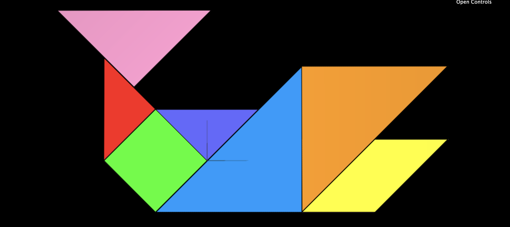
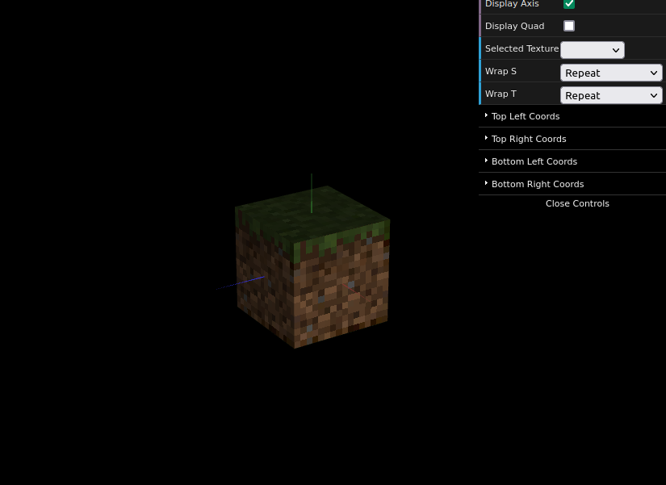

# CG 2022/2023

## Group T06G03

## TP 4 Notes

- In exercise 1 we had some difficulties in the start to be able to change the TexCoords of the triangle so we could use just one MyTriangle instance .

- In exercise 2 a problem was figuring how to render the texture with 'nearest'.

