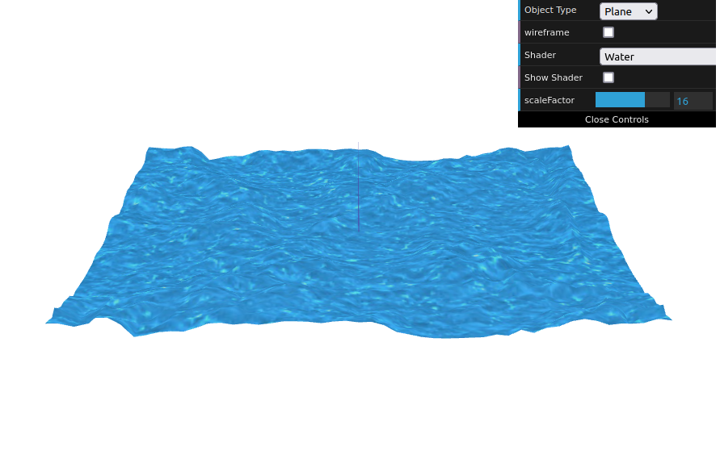

# CG 2022/2023

## Group T06G03

## TP 5 Notes

- In exercise 1 we had some difficulties figuring how to share variables between shaders.

### 1.1

### 1.2

- In exercise 2 we had some difficulties adjusting the right coefficients to match the example's motion.

